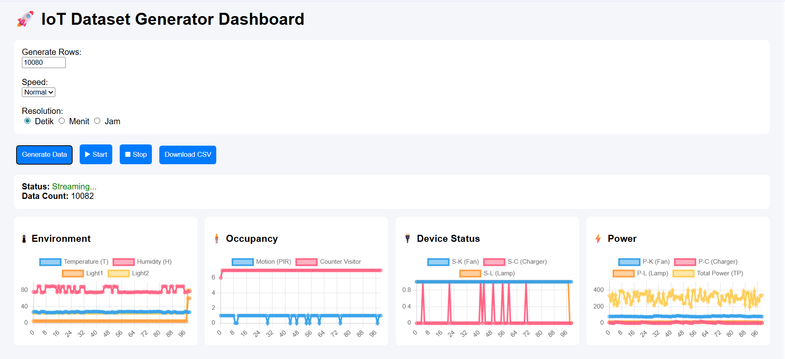

# 🚀 IoT Dataset Generator & Smart Home Simulator

A realistic **IoT data simulation engine** for smart home environments, built for **Data Engineering, IoT systems, and Machine Learning experimentation**.

---

## 📸 Preview



> 💡 Tip: Tambahkan screenshot dashboard kamu ke folder `assets/` dengan nama `dashboard.png`

---

## 🌐 Live Demo

👉 **Try it here:**
https://maulina2705.github.io/iot-dataset-generator/

[](https://maulina2705.github.io/iot-dataset-generator/)

---

## 🧠 Project Overview

This project simulates a **realistic smart home environment** with interconnected IoT devices and sensors.

Unlike typical random data generators, this system models:

* 🌡️ Environmental dynamics (temperature, humidity, light)
* 🧍 Human behavior (occupancy, motion/PIR)
* 🔌 Smart device automation (fan, lamp, charger)
* ⚡ Energy consumption (device-level & total household power)

All variables are **interdependent**, producing realistic time-series data.

---

## 🔥 Key Features

### 🎯 Realistic Simulation Engine

* Time-based behavior (day/night cycle)
* Weather transitions (clear, cloudy, rain)
* Occupancy-driven system logic
* Sensor-to-device relationships

---

### ⚡ Advanced Power Modeling

* Smooth **ramp-up / ramp-down**
* Realistic **power fluctuation**
* Noise & micro spikes
* Dynamic load behavior (non-linear)

---

### 📊 Interactive Dashboard

* Real-time streaming simulation
* Multi-panel visualization:

  * 🌡 Environment
  * 🧍 Occupancy
  * 🔌 Device Status
  * ⚡ Power

---

### ⏱️ Multi-Resolution Data

* Base resolution: **per second**
* Aggregated views:

  * per minute
  * per hour

---

### 📦 Dataset Generation

* Custom row generation (up to thousands of records)
* Export to CSV
* Ready for:

  * Machine Learning
  * Data pipelines
  * Anomaly detection

---

## 📊 Example Data Schema

```json
{
  "timestamp": "...",
  "temperature": 27.4,
  "humidity": 75.2,
  "light": 32,
  "light_out": 60,
  "pir": 1,
  "occupancy": 3,
  "fan_status": 1,
  "lamp_status": 1,
  "charger_status": 0,
  "fan_power": 72.3,
  "lamp_power": 10.8,
  "charger_power": 0,
  "total_power": 280.5
}
```

---

## ⚙️ System Architecture

```text
Simulation Engine (per second)
        ↓
Aggregation Layer (minute/hour)
        ↓
Visualization (Chart.js)
        ↓
Export (CSV)
```

---

## 🧩 Data Relationships

* Temperature ↑ → Fan ON → Power ↑
* Low Light + Occupancy → Lamp ON
* Occupancy ↑ → Heat ↑ → Fan Trigger
* Charger usage follows daily human behavior
* Total Power = Room Power + Household baseline + noise

---

## 🛠️ Tech Stack

* HTML, CSS, JavaScript (Vanilla)
* Chart.js (Visualization)
* GitHub Pages (Deployment)

---

## 🚀 Getting Started

### 1. Clone repository

```bash
git clone https://maulina2705.github.io/iot-dataset-generator.git
```

### 2. Open project

```bash
cd iot-dataset-generator/docs
```

### 3. Run locally

Open `index.html` in your browser

---

## 🌐 Deployment (GitHub Pages)

1. Go to **Settings → Pages**
2. Source: `Deploy from branch`
3. Branch: `main`
4. Folder: `/docs`
5. Save

---

## 🎯 Use Cases

* 📊 Data Engineering Practice
* 🤖 Machine Learning Dataset Generation
* 🔍 Anomaly Detection Testing
* 🏠 Smart Home Simulation
* ⚡ Energy Consumption Analysis

---

## 🧪 Future Improvements

* 🔴 Anomaly Injection Engine
* 📡 MQTT / API Streaming Simulation
* 🧠 ML Model Integration (Auto anomaly detection)
* 🗄️ Database Integration (Time-series storage)

---

## 💡 Why This Project Matters

Most datasets are:

* static
* random
* unrealistic

This project focuses on:

> **dynamic, interconnected, and behavior-driven IoT data simulation**

---

## 👨‍💻 Author

Built as a portfolio project for:

* Data Engineering
* IoT Systems
* AI Integration

---

## ⭐ Support

If you find this project useful:

* ⭐ Star this repository
* 🍴 Fork it
* 🚀 Build your own version

---

## 📌 Final Note

This is not just a dataset generator.

> It is a **mini simulation engine for real-world IoT systems**
