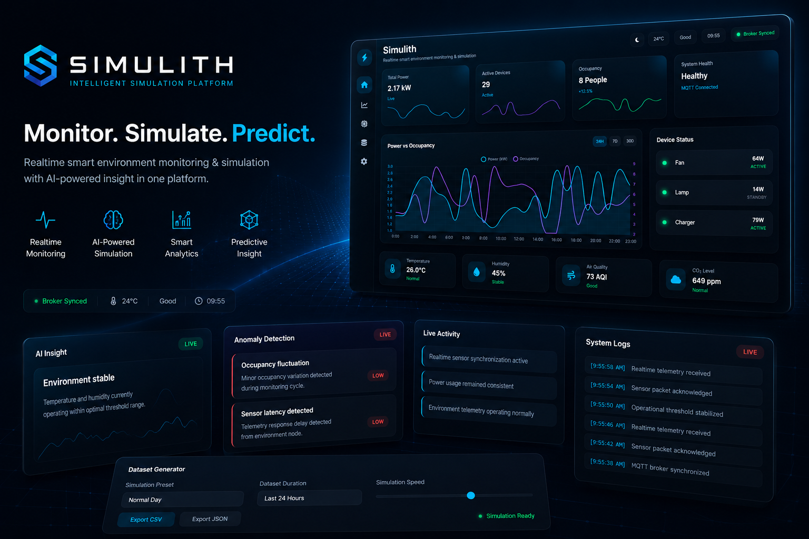
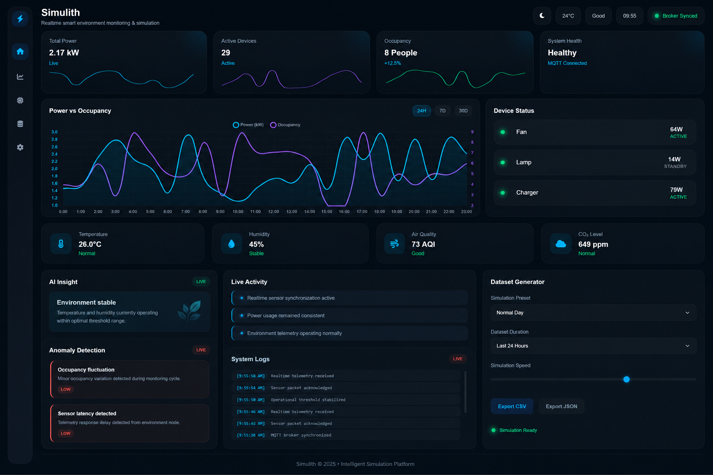
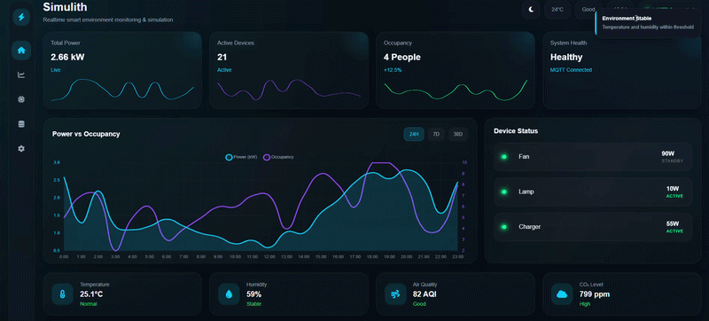
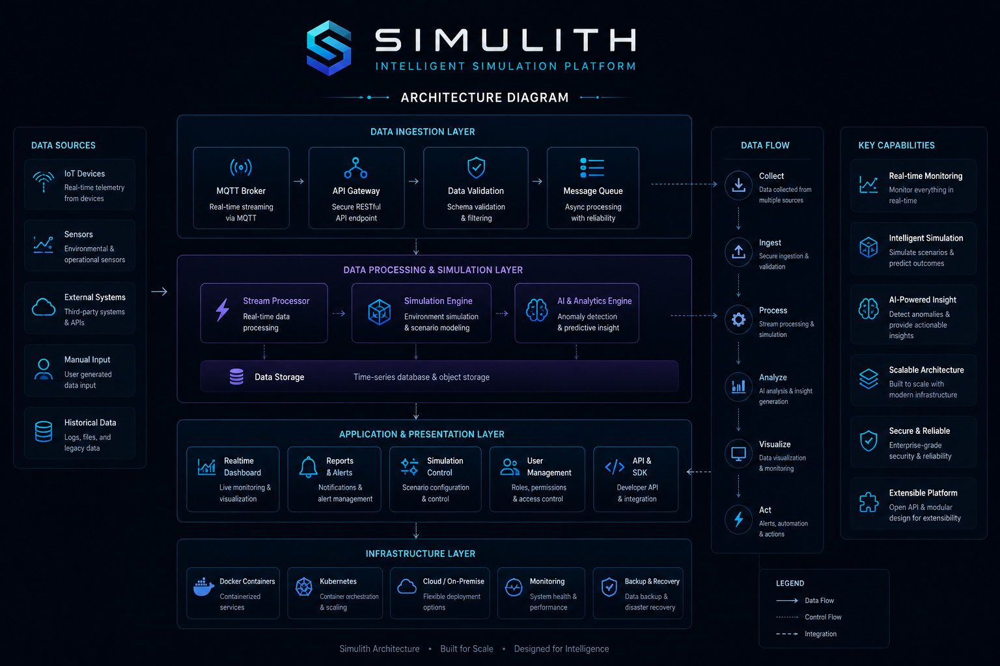

<p align="center">
  
</p>

<p align="center">
  
</p>

<p align="center">
  
</p>

<p align="center">


</p>

<p align="center">
  
</p>


## Core Capabilities

<table>
<tr>

<td width="25%">

### Realtime Telemetry

Simulates synchronized operational telemetry streams across a live monitoring environment.

</td>

<td width="25%">

### Operational Simulation

Contextual behavioral simulation based on dynamic environmental presets.

</td>

<td width="25%">

### Dataset Engine

Generates exportable operational datasets through simulated telemetry memory systems.

</td>

<td width="25%">

### Adaptive Interface

Responsive operational UI with realtime visual synchronization and adaptive themes.

</td>

</tr>
</table>

<p align="center">
  
</p>

<p align="center">
Designed to mimic a living telemetry ecosystem —<br>
without relying on real hardware.
</p>

<p align="center">

<a href="./README.md">
  
</a>

<a href="./README.id.md">
  
</a>

</p>

<p align="center">


</p>

<p align="center">
  
</p>

## Realtime Monitoring & Intelligent Operational Simulation

Simulith is an immersive telemetry simulation platform designed to emulate how modern monitoring systems behave in live operational environments — without relying on physical sensors or realtime hardware infrastructure.

<p align="center">
  
</p>

## Overview

Simulith is a realtime telemetry and operational simulation dashboard designed to emulate how modern monitoring systems behave in production-like environments.

The platform continuously simulates operational behavior including:

* realtime telemetry
* occupancy activity
* environmental monitoring
* anomaly detection
* contextual system reactions
* operational logging

without relying on physical hardware infrastructure.

<p align="center">
  
</p>

## System Preview

### Realtime Operational Dashboard

<p align="center">
  
</p>

Simulith visualizes operational telemetry through a responsive realtime monitoring interface designed to simulate production-like monitoring behavior.

The dashboard includes:

* contextual telemetry visualization
* realtime activity flow
* anomaly monitoring
* adaptive environment tracking
* synchronized operational feedback

<p align="center">
  
</p>

### Realtime Simulation Environment

<p align="center">
  
</p>

The interface continuously reacts to simulation presets and contextual operational changes to create a monitoring experience that feels persistent and alive.

<p align="center">
  
</p>

## Core Systems

| System                        | Description                                                             |
| ----------------------------- | ----------------------------------------------------------------------- |
| Realtime Telemetry Engine     | Simulates persistent operational telemetry streams across the dashboard |
| Contextual Simulation Presets | Dynamically changes system behavior based on operational scenarios      |
| Live Operational Logs         | Generates synchronized realtime activity and telemetry events           |
| Dataset Generator             | Produces exportable operational datasets in JSON and CSV formats        |
| Adaptive UI Engine            | Supports responsive dark/light operational visualization                |
| Anomaly Detection System      | Simulates operational inconsistencies and environmental alerts          |
| Smart Environment Monitoring  | Simulates temperature, humidity, occupancy, and air quality behavior    |
| Visualization Layer           | Provides realtime chart synchronization and telemetry rendering         |

### Live Activity & Operational Logs

The dashboard continuously generates:

- Realtime activity updates
- Operational events
- Telemetry logs
- Contextual notifications

This creates a persistent operational atmosphere across the system.

<p align="center">
  
</p>

### Dataset Generator

Simulith includes an internal telemetry memory engine capable of:

- JSON export
- CSV export
- Historical telemetry storage
- Realtime dataset generation

<p align="center">
  
</p>

### Adaptive UI System

Includes:

- Dark / light theme switching
- Realtime visual feedback
- Responsive dashboard layout
- Glow-based operational UI styling

<p align="center">
  
</p>

### Upcoming Features

The following systems are planned for future updates:

- Predictive Analytics
- AI Forecast Engine
- MQTT Integration
- Historical Analytics Pipeline
- Smart Correlation Engine
- Advanced Mobile Optimization
- Modular Frontend Architecture

<p align="center">
  
</p>

## How Simulith Works

```text
Simulation Preset
        ↓
Realtime Telemetry Engine
        ↓
Contextual System Update
        ↓
Logs / Activity / Toasts
        ↓
Anomaly Detection
        ↓
Dataset Memory Engine
        ↓
Export Pipeline
```

<p align="center">
  
</p>

## Technical Architecture

### Current Stack

| Layer | Technology |
|---|---|
| Frontend | HTML5, CSS3, JavaScript |
| Visualization | Chart.js |
| State Logic | Realtime Simulation Loop |
| UI System | Adaptive Dark / Light Theme |
| Dataset System | In-memory Telemetry Storage |
| Export System | CSV / JSON Generation |

<p align="center">
  
</p>

### Architecture Diagram

<p align="center">
  
</p>

<p align="center">
  
</p>

## UI / UX Philosophy

Simulith was designed around one primary principle:

> A monitoring dashboard should feel alive.

Instead of presenting isolated cards and charts, the system attempts to simulate operational continuity through:

- synchronized behavioral systems
- contextual telemetry reactions
- realtime operational feedback
- adaptive visualization
- persistent activity flow

The objective is to create a dashboard experience that feels immersive rather than static.

<p align="center">
  
</p>

## Design Philosophy

Most monitoring dashboards visualize data.

Simulith attempts to visualize behavior.

Instead of creating a static monitoring interface, the system was designed to simulate how operational environments *feel* when telemetry systems continuously react, synchronize, and evolve in realtime.

Every section of the dashboard was intentionally built to contribute to the illusion of a living operational ecosystem:

- synchronized telemetry movement
- contextual anomaly reactions
- persistent activity generation
- adaptive environmental changes
- operational continuity

The objective is not hardware accuracy.

The objective is operational immersion.

<p align="center">
  
</p>

## Project Structure

```bash
simulith/
│
├── docs/
│   ├── index.html
│   ├── style.css
│   └── script.js
│
├── assets/
│   ├── animations/
│   ├── branding/
│   └── branding/
│
└── README.md
```

<p align="center">
  
</p>

## Installation

```bash
git clone https://github.com/your-username/simulith.git
cd simulith
```

Open:

```bash
docs/index.html
```

<p align="center">
  
</p>

## Roadmap

| Feature | Status |
|---|---|
| Realtime Telemetry Engine | Completed |
| Contextual Simulation Presets | Completed |
| Adaptive Theme System | Completed |
| Dataset Memory Engine | Completed |
| CSV / JSON Export | In Progress |
| Predictive Analytics | Soon |
| MQTT Integration | Soon |
| Forecasting Engine | Soon |
| Mobile Optimization | Soon |
| Modular Architecture Refactor | Soon |

<p align="center">
  
</p>

## License

MIT License

<p align="center">
  
</p>

## Final Notes

Simulith is not intended to replicate a fully production-grade telemetry platform.

Instead, it explores how simulated operational behavior, synchronized telemetry systems, and immersive UI feedback can create the illusion of a living monitoring ecosystem.

The entire experience is simulated.

That is the point.
